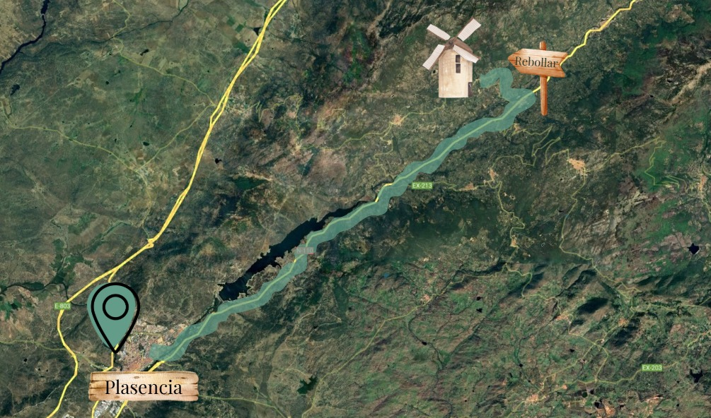

En el mapa hemos incluido el recorrido de autobús desde Plasencia ([ubicación](https://maps.app.goo.gl/kyPRRKuXTm8ytZ9m9)) hasta El Molino de Viriato ([ubicación](https://maps.app.goo.gl/hBh7RaWUMxLwo2do9)), sobre el que intentaremos añadir las paradas que podamos y que os vengan mejor.

Si necesitáis más información sobre casas rurales u hoteles por la zona, no dudéis en mandarle un mensajito a la extremeña para que os eche una mano.

