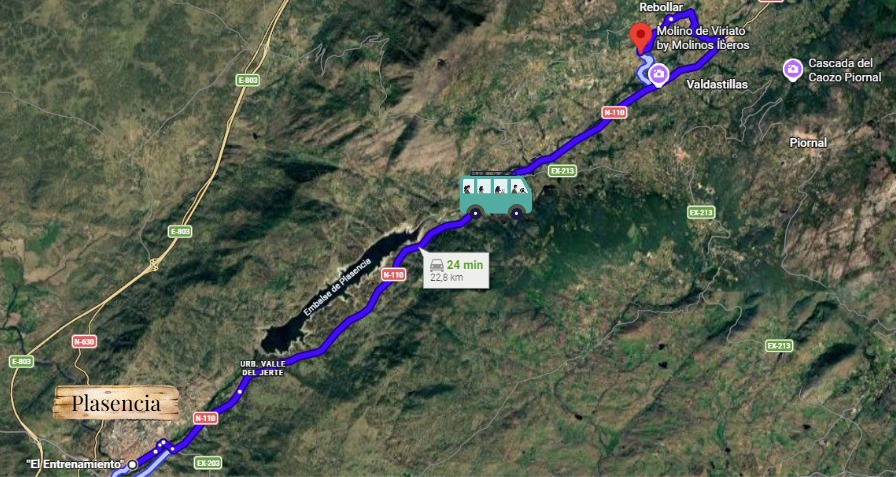
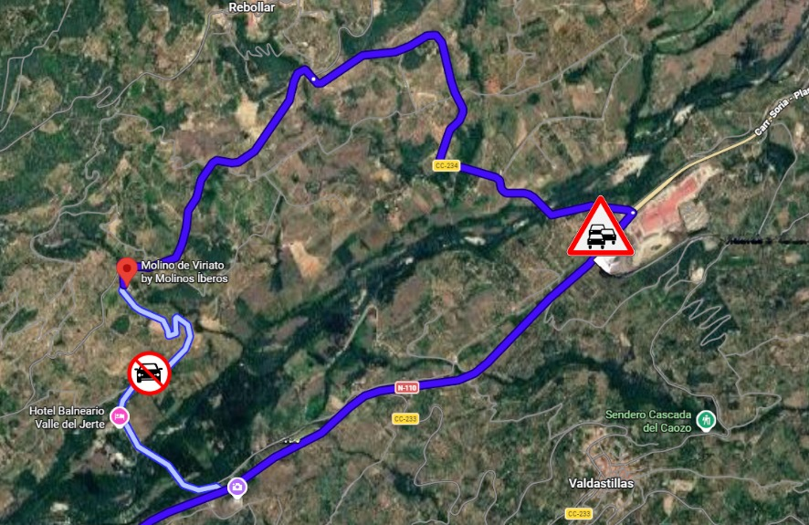

El Molino de Viriato ([ubicación](https://maps.app.goo.gl/hBh7RaWUMxLwo2do9)) está  cerquita de Plasencia, a unos 20 minutos en coche. Si venís en autobús, este saldrá **a las 17:30 h** desde [aquí](https://maps.app.goo.gl/kyPRRKuXTm8ytZ9m9), aunque intentaremos incluir varias paradas en el recorrido que os vengan bien.

Si venís en coche, primero debéis tomar la N-110 en dirección Valle del Jerte / Ávila y recorrer unos 22 km. Llegaréis a la intersección con la carretera del Rebollar (CC-234), que encontraréis a vuestra izquierda.
Continuad por esa carretera hasta encontrar una salida a la izquierda en una curva cerrada, señalizada con un gran cartel de "Parque Aventura" y, un poco más discretamente, "Molino de Viriato".
A partir de ahí, conduciréis unos minutos entre cerezos. Os recomendamos ir despacito por si se cruza algún zorro o ciervo despistado.

**¡IMPORTANTE!** Google Maps sugiere una ruta más corta desde Plasencia pasando por el *Hotel Balneario Valle del Jerte*, pero esa carretera se encuentra abandonada. Para llegar al Molino sanos y salvos, os recomendamos seguir las indicaciones descritas arriba.

¡Os estaremos esperando!

